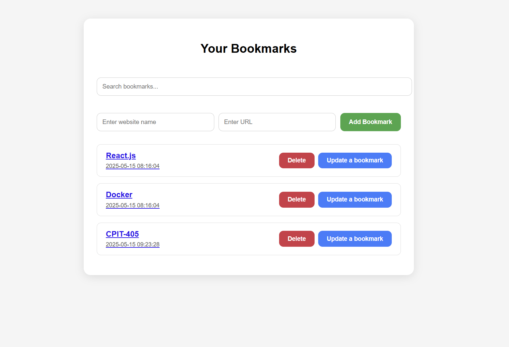
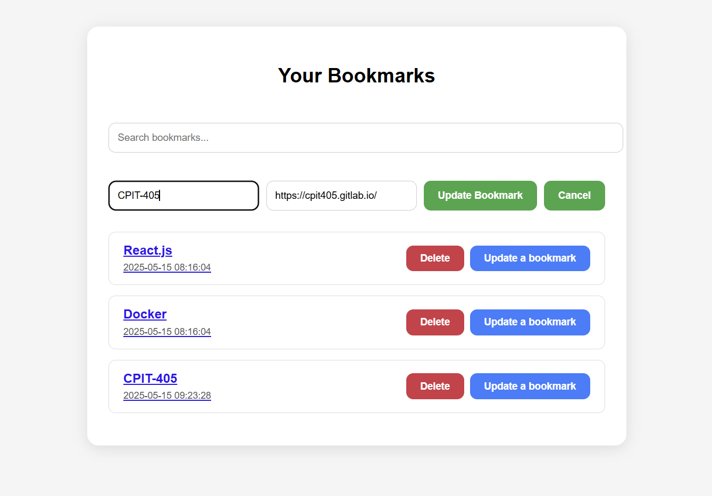
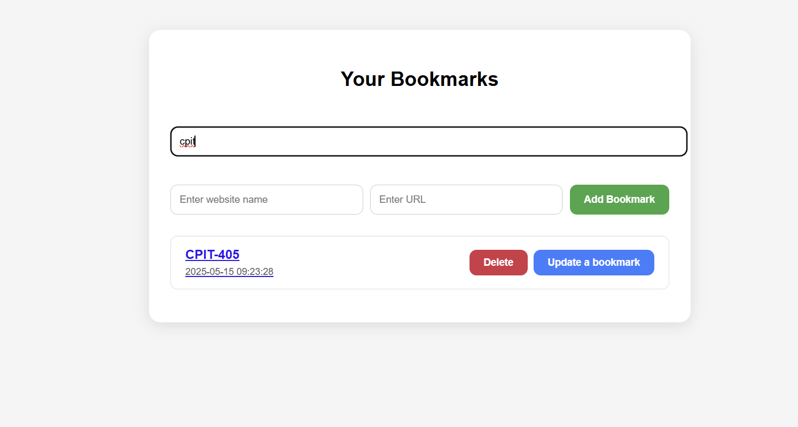

#  Bookmark App

BookmarkApp is a simple web-based application that allows users to save, view, and manage their favorite websites. It is built using **PHP** for the backend and **MariaDB** as the database, with **React** as a frontend.

## Features

- Add new bookmarks (Title and URL)
- View all saved bookmarks
- search for any saved bookmarks
- Update any bookmark (Title and URL)
- Delete unwanted bookmarks
- Responsive and interactive user interface

## 🛠️ Installation Guide

To run this project locally, you'll need to install **PHP** and **MariaDB**.

🔗 **Follow this tutorial to install PHP and MariaDB**:  
[https://www.youtube.com/watch?v=ohweQPLhvSs](https://www.youtube.com/watch?v=ohweQPLhvSs)

###  Set Up the Database

Open your terminal and run the following:

```bash
mysql -u root -p
```

Then execute these SQL commands to create the database and table:

```sql
CREATE DATABASE bookmarking_db;
USE bookmarking_db;

CREATE TABLE bookmarks (
  id MEDIUMINT NOT NULL AUTO_INCREMENT,
  title VARCHAR(255) NOT NULL,
  link VARCHAR(255) NOT NULL,
  date_added DATETIME NOT NULL,
  done BOOLEAN NOT NULL DEFAULT false,
  PRIMARY KEY (id)
);

INSERT INTO bookmarks(title, link, date_added) VALUES ('React.js', 'https://react.dev', NOW());
INSERT INTO bookmarks(title, link, date_added) VALUES ('Docker', 'https://docker.com', NOW());
INSERT INTO bookmarks(title, link, date_added) VALUES ('GitHub', 'https://github.com', NOW());
```

##  Screenshots of the UI

A visual walkthrough of the **Bookmark App** interface:

###  View the saved bookmarks


### Update


### Search


---

Feel free to customize the app and extend it with more features!